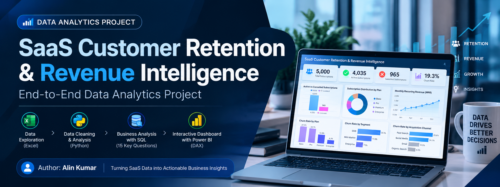
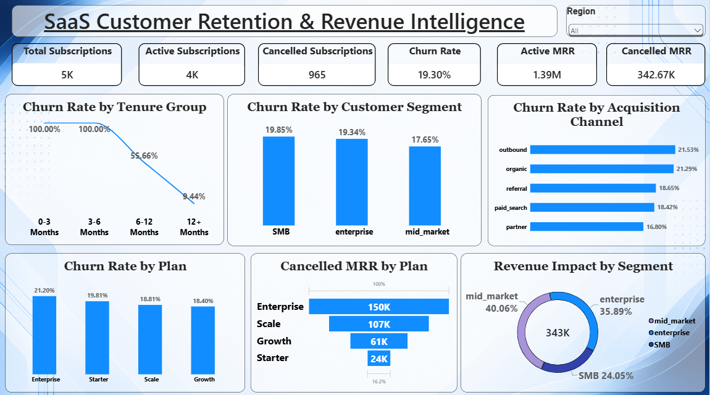
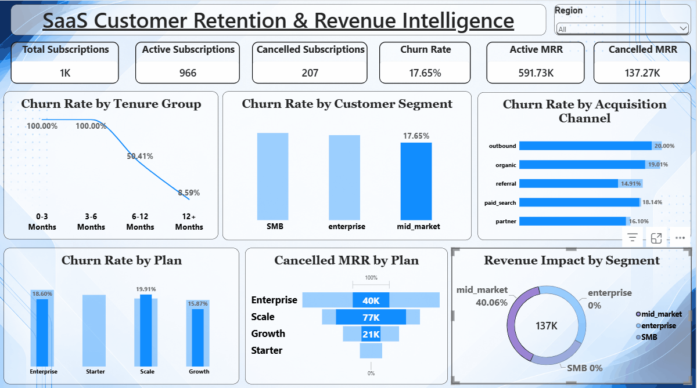

<div align="center">



# ⚡ SaaS Customer Retention & Revenue Intelligence

### End-to-End Data Analytics & Business Intelligence

**From raw SaaS data → validated datasets → SQL analysis → Power BI insights**

[](https://www.python.org/)
[](https://pandas.pydata.org/)
[](https://www.mysql.com/)
[](https://powerbi.microsoft.com/)
[](https://www.microsoft.com/microsoft-365/excel)
[](https://learn.microsoft.com/dax/)

### 👨‍💻 Built by **Alin Kumar**

</div>

---

## 🔵 Project at a Glance

> A complete SaaS analytics case study focused on customer retention, subscription churn, recurring revenue, customer segmentation and revenue impact.

```text
SaaS DATA → PYTHON / PANDAS → MYSQL / SQL → POWER QUERY → POWER BI + DAX → BUSINESS INSIGHTS
```

## 🚀 Project Overview

**SaaS Customer Retention & Revenue Intelligence** is an end-to-end **Data Analytics & Business Intelligence** project built to understand subscription retention, churn and recurring-revenue impact for a SaaS business.

The project works across five related datasets — **accounts, plans, subscriptions, invoices and payments** — and follows a complete analytics workflow:

```text
RAW SAAS DATA
      ↓
PYTHON / PANDAS
Data Profiling + Validation + Cleaning
      ↓
MYSQL / SQL
15 Business-Focused Analysis Queries
      ↓
POWER QUERY
BI Data Preparation
      ↓
POWER BI + DAX
Interactive Dashboard + KPI Analysis
      ↓
BUSINESS INSIGHTS
Retention + Churn + Revenue Impact
```

The final solution converts raw subscription and billing data into **business-ready KPIs, dimensional analysis and interactive insights** that can support retention investigations and recurring-revenue monitoring.

### 🎯 What I Solved

Instead of looking only at total customers or total revenue, the project answers:

- How many subscriptions are active vs cancelled?
- What is the observed subscription churn rate?
- How much recurring revenue is associated with active subscriptions?
- How much recurring revenue is associated with cancelled subscriptions?
- How does churn vary across **plans, customer segments, acquisition channels and tenure**?
- Which customer cohorts show meaningful churn and recurring-revenue impact?
- How can these findings be presented through an interactive BI dashboard?

### 🛠️ What I Did

| Stage | Work Performed |
|---|---|
| 📥 Data Understanding | Explored five related SaaS datasets and their relationships |
| 🧹 Data Quality | Checked dimensions, data types, missing values, duplicates, dates, IDs and relationships |
| 🐍 Python / Pandas | Validated, cleaned and exported analysis-ready datasets |
| 🗄️ MySQL / SQL | Created 15 business-focused queries covering revenue, churn and customer dimensions |
| 🔎 Diagnostic Analysis | Compared churn by plan, segment, acquisition channel and tenure |
| 💰 Revenue Analysis | Measured Active MRR and Cancelled MRR to understand recurring-revenue impact |
| 🔄 Power Query | Prepared cleaned data for the BI layer |
| 📊 Power BI | Built an interactive retention and revenue dashboard |
| 🧮 DAX | Created dynamic KPI measures for subscriptions, churn and MRR |
| 💡 Business Storytelling | Converted analytical results into insights, recommendations and investigation areas |

### 💼 How the Business Problem Was Addressed

The analysis moves from a simple **“How much churn do we have?”** question to a more useful diagnostic view:

```text
CHURN
  ↓
PLAN
  +
CUSTOMER SEGMENT
  +
ACQUISITION CHANNEL
  +
TENURE
  ↓
CUSTOMER COHORTS
  ↓
CANCELLED MRR
  ↓
REVENUE IMPACT
```

This approach helps distinguish between **high churn percentage** and **meaningful recurring-revenue impact**. A cohort with a high churn rate is not automatically the cohort with the largest revenue impact, so customer volume and Cancelled MRR are considered together.

### 📈 Final Analytical Outcome

The project produced a retention baseline of:

| KPI | Result |
|---|---:|
| **Total Subscriptions** | **5,000** |
| **Active Subscriptions** | **4,035** |
| **Cancelled Subscriptions** | **965** |
| **Observed Subscription Churn** | **19.30%** |
| **Active MRR** | **1,387,441** |
| **Cancelled MRR** | **342,673** |

The final Power BI dashboard makes these KPIs and their underlying dimensions easier to explore through interactive filtering and visual analysis.

> **Important:** Cancelled MRR is treated as an analytical recurring-revenue impact metric associated with cancelled subscriptions. It is **not** interpreted as accounting loss or profit loss.

## 🎯 Business Problem

A SaaS business depends on recurring subscriptions. Looking only at total customers or total revenue can hide important retention problems.

This project answers:

- How many subscriptions are active or cancelled?
- What is the overall subscription churn rate?
- How much active MRR is associated with active subscriptions?
- How much recurring revenue is associated with cancelled subscriptions?
- How does churn vary by plan, segment, acquisition channel and tenure?
- Which customer cohorts deserve further investigation?

## 📊 Executive KPI Snapshot

| 🟦 KPI | 🔢 Actual Result |
|---|---:|
| **Total Subscriptions** | **5,000** |
| **Active Subscriptions** | **4,035** |
| **Cancelled Subscriptions** | **965** |
| **Subscription Churn Rate** | **19.30%** |
| **Active MRR** | **1,387,441** |
| **Cancelled MRR** | **342,673** |

> **Important:** Cancelled MRR represents recurring revenue associated with cancelled subscriptions. It is an analytical revenue-impact metric, not accounting loss or profit loss.

## 🧩 Dataset Architecture

| Table | Rows | Purpose |
|---|---:|---|
| `accounts` | 5,000 | Customer/account attributes |
| `plans` | 4 | SaaS plan definitions |
| `subscriptions` | 5,000 | Subscription lifecycle, status, seats and MRR |
| `invoices` | 85,448 | Billing activity |
| `payments` | 87,287 | Payment attempts and status |

```text
ACCOUNTS ───────► SUBSCRIPTIONS ◄─────── PLANS
                       │
                       ▼
                   INVOICES
                       │
                       ▼
                   PAYMENTS
```

## 🧹 Data Preparation & Validation

Python/Pandas was used to prepare and validate the five datasets.

**Checks included:**

`Dimensions` • `Data Types` • `Missing Values` • `Duplicates` • `Dates` • `IDs` • `Invoices` • `Payments` • `Foreign Keys` • `NULL Handling` • `Region Validation`

### Cleaning Pipeline

```text
Raw CSVs
   ↓
Profiling & Quality Checks
   ↓
Missing / Duplicate / Type Investigation
   ↓
Date + ID + Relationship Validation
   ↓
Business-safe Cleaning
   ↓
Cleaned CSV Exports
   ↓
SQL + Power BI
```

The `ended_at` NULL values for active subscriptions were preserved as meaningful lifecycle information.

📓 **Notebook:** `Python/SaaS_Project.ipynb`

## 🗄️ SQL Analytics

The SQL layer was structured around **15 business questions**.

| Phase | Questions | Focus |
|---|---:|---|
| 🟦 Business Overview | Q01–Q02 | Accounts, subscriptions, plans |
| 💰 Revenue | Q03–Q06 | MRR and revenue |
| 📉 Churn | Q07–Q09 | Overall and plan churn |
| 👥 Dimensions | Q10–Q12 | Segment, channel, tenure |
| 🔎 Root Cause | Q13–Q14 | Cohorts and revenue impact |
| 🧠 Summary | Q15 | Retention and revenue |

### 15 Questions

1. Total accounts & active subscriptions  
2. Subscriptions by plan  
3. Active MRR  
4. Revenue by plan  
5. Active vs cancelled subscriptions  
6. Cancelled MRR  
7. Overall subscription churn  
8. Churn by plan  
9. Cancelled MRR by plan  
10. Churn by customer segment  
11. Churn by acquisition channel  
12. Churn by customer tenure  
13. Customer retention root-cause analysis  
14. Churn & revenue impact by business dimensions  
15. Final retention & revenue summary  

📁 **Queries:** `SQL/`  
📈 **Outputs:** `SQL_Outputs/`

## 🔍 Key Findings

### 01 — Retention Baseline

Out of **5,000 subscriptions**, **4,035 are active** and **965 are cancelled**, producing an observed subscription churn rate of **19.30%**.

### 02 — Plan Analysis

Churn was compared across Starter, Growth, Scale and Enterprise plans, while considering both customer volume and cancelled MRR.

### 03 — Customer Segments

Customer behaviour was analysed across SMB, Mid-Market and Enterprise segments to identify differences in observed cancellation patterns.

### 04 — Acquisition Channels

Observed churn was compared across Outbound, Organic, Referral, Paid Search and Partner channels. Channel differences are treated as signals for investigation, not proof of causation.

### 05 — Tenure

Customer tenure was analysed to understand how cancellation patterns vary across lifecycle stages.

## 🧠 Multi-Dimensional Root-Cause Analysis

The project combines:

```text
PLAN
  +
CUSTOMER SEGMENT
  +
ACQUISITION CHANNEL
  +
TENURE
```

This moves the analysis from **“What is churn?”** toward **“Which customer cohorts show high observed churn and what is their associated recurring-revenue impact?”**

A high churn percentage does not automatically mean the highest revenue impact, so both customer volume and cancelled MRR are considered.

## 💰 Revenue Impact

```text
SUBSCRIPTION CHURN
        │
        ├──► Customer Volume
        │
        └──► Revenue Impact
                 │
                 └──► Cancelled MRR
```

This distinction prevents churn percentage from being interpreted as financial loss.

## 📊 Power BI Dashboard

The cleaned datasets were transformed into an interactive Power BI dashboard.

**KPI layer:** Total Subscriptions • Active Subscriptions • Cancelled Subscriptions • Churn Rate • Active MRR • Cancelled MRR

**Analytics:** Churn by Tenure • Churn by Segment • Churn by Acquisition Channel • Churn by Plan • Cancelled MRR by Plan • Revenue Impact by Segment

**Filter:** Region slicer

<div align="center">

</div>

## 🎬 Interactive Dashboard Walkthrough

<div align="center">

</div>

```text
Filter Selection
      ↓
Filter Context Changes
      ↓
DAX Measures Recalculate
      ↓
Visuals Update
      ↓
Business Pattern Becomes Visible
```

## 📐 Core DAX

```DAX
Total Subscriptions =
COUNTROWS(subscriptions_clean)
```

```DAX
Active Subscriptions =
CALCULATE(
    COUNTROWS(subscriptions_clean),
    subscriptions_clean[status] = "active"
)
```

```DAX
Cancelled Subscriptions =
CALCULATE(
    COUNTROWS(subscriptions_clean),
    subscriptions_clean[status] = "cancelled"
)
```

```DAX
Churn Rate =
DIVIDE(
    [Cancelled Subscriptions],
    [Total Subscriptions],
    0
)
```

```DAX
Active MRR =
CALCULATE(
    SUM(subscriptions_clean[mrr]),
    subscriptions_clean[status] = "active"
)
```

```DAX
Cancelled MRR =
CALCULATE(
    SUM(subscriptions_clean[mrr]),
    subscriptions_clean[status] = "cancelled"
)
```

## 💡 Business Insights

- 🔵 Overall churn provides the baseline; dimensional analysis reveals where observed differences occur.
- 🔵 Tenure provides important lifecycle context for retention analysis.
- 🔵 Churn percentage and revenue impact should be evaluated separately.
- 🔵 Acquisition-channel differences should be investigated alongside plan, segment and tenure.
- 🔵 Multi-dimensional cohort analysis provides stronger diagnostic context than one-dimensional churn analysis.

## 🎯 Data-Driven Recommendations

1. **Strengthen early-tenure onboarding** by investigating activation and early customer experience.
2. **Monitor high-value cancellations** using cancelled MRR alongside churn counts.
3. **Investigate acquisition-channel quality** with plan, segment and tenure context.
4. **Build recurring retention monitoring** around churn and cancelled MRR.

## 🧱 Project Structure

```text
SaaS-Customer-Retention-Revenue-Intelligence/
│
├── 📊 Data/
│   └── Cleaned/
│       ├── accounts_clean.csv
│       ├── plans_clean.csv
│       ├── subscriptions_clean.csv
│       ├── invoices_clean.csv
│       └── payments_clean.csv
│
├── 🖼️ Images/
│   ├── project_banner.png
│   └── Dashboard_Screenshot.png
│
├── 📊 PowerBI/
│   ├── Dashboard_Screenshot.png
│   └── powerbi_dashboard_preview.gif
│
├── 🐍 Python/
│   └── SaaS_Project.ipynb
│
├── 📄 Report/
│   └── SaaS_Customer_Retention_Revenue_Intelligence.pdf
│
├── 🗄️ SQL/
│   └── 15 Business Analysis Queries
│
├── 📈 SQL_Outputs/
│   └── 15 SQL Result Screenshots
│
├── 📦 requirements.txt
│
├── 🚫 .gitignore
│
└── 📘 README.md
```

## 🧰 Tech Stack

| Layer | Tools |
|---|---|
| 📥 Data | Excel, CSV |
| 🐍 Analysis | Python, Pandas, NumPy |
| 🗄️ Database | MySQL |
| 🔎 Querying | SQL |
| 🔄 Transformation | Power Query |
| 📊 BI | Power BI |
| 🧮 Calculations | DAX |
| 📓 Documentation | Jupyter Notebook |
| 🚀 Portfolio | GitHub |

## 📄 Detailed Project Report

📘 **[Open the complete project report](Report/SaaS_Customer_Retention_Revenue_Intelligence.pdf)**

The report documents the analytical methodology, data preparation, SQL analysis, Power BI work, findings and recommendations.

## ⚠️ Analytical Limitations

- The dataset is synthetic/educational.
- The analysis is descriptive and diagnostic, not predictive.
- Observed relationships do not establish causation.
- Churn should be interpreted alongside customer volume and revenue impact.
- Cancelled MRR is an analytical recurring-revenue metric, not an accounting loss measure.
- SQL and dashboard calculations should be validated when reproducing the project.

## 🏆 Skills Demonstrated

```text
🐍 Python / Pandas
🧹 Data Cleaning & Validation
🗄️ SQL & Relational Analysis
📊 Power BI
🧮 DAX
💰 MRR & Revenue Analytics
📉 Churn & Retention Analytics
👥 Customer Segmentation
🔎 Cohort / Root-Cause Analysis
💡 Business Storytelling
```

## 👨‍💻 About the Author

<div align="center">

### **Alin Kumar**

**Data Analytics | SQL | Python | Power BI | Excel**

Transforming raw business data into structured analysis, interactive dashboards and actionable insights.

📧 **[alinkumar2977@gmail.com](mailto:alinkumar2977@gmail.com)**

💼 **[LinkedIn](https://www.linkedin.com/in/alinkumar2977/)**

🐙 **[GitHub](https://github.com/alinkumar2977)**

</div>

---

<div align="center">

### 🔷 DATA → SQL → BI → INSIGHTS

**Built with Python • SQL • Power BI • DAX**

⭐ **If you found this project useful, consider starring the repository.**

### © Alin Kumar

</div>
